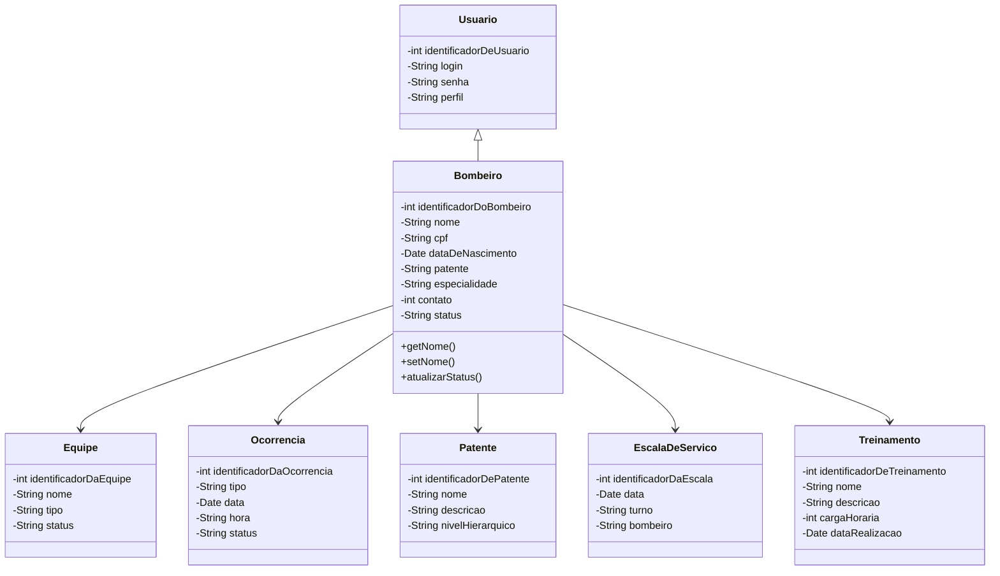

## 📊 Diagrama de Classes

```mermaid
classDiagram
    class Usuario {
        -int identificadorDeUsuario
        -String login
        -String senha
        -String perfil
    }

    class Bombeiro {
        -int identificadorDoBombeiro
        -String nome
        -String cpf
        -Date dataDeNascimento
        -String patente
        -String especialidade
        -int contato
        -String status

        +getNome()
        +setNome()
        +atualizarStatus()
    }

    class Equipe {
        -int identificadorDaEquipe
        -String nome
        -String tipo
        -String status
    }

    class Ocorrencia {
        -int identificadorDaOcorrencia
        -String tipo
        -Date data
        -String hora
        -String status
    }

    class Patente {
        -int identificadorDePatente
        -String nome
        -String descricao
        -String nivelHierarquico
    }

    class EscalaDeServico {
        -int identificadorDaEscala
        -Date data
        -String turno
        -String bombeiro
    }

    class Treinamento {
        -int identificadorDeTreinamento
        -String nome
        -String descricao
        -int cargaHoraria
        -Date dataRealizacao
    }

    Usuario <|-- Bombeiro

    Bombeiro --> Equipe
    Bombeiro --> Ocorrencia
    Bombeiro --> Patente
    Bombeiro --> EscalaDeServico
    Bombeiro --> Treinamento
```
