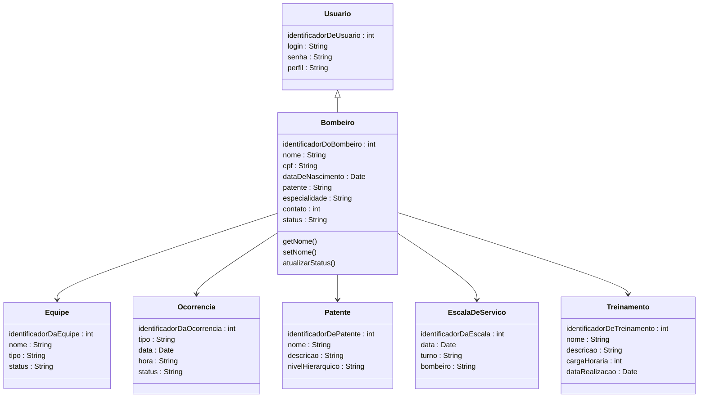

## 📊 Diagrama de Classes

```mermaid
classDiagram
    class Usuario {
        identificadorDeUsuario : int
        login : String
        senha : String
        perfil : String
    }

    class Bombeiro {
        identificadorDoBombeiro : int
        nome : String
        cpf : String
        dataDeNascimento : Date
        patente : String
        especialidade : String
        contato : int
        status : String

        getNome()
        setNome()
        atualizarStatus()
    }

    class Equipe {
        identificadorDaEquipe : int
        nome : String
        tipo : String
        status : String
    }

    class Ocorrencia {
        identificadorDaOcorrencia : int
        tipo : String
        data : Date
        hora : String
        status : String
    }

    class Patente {
        identificadorDePatente : int
        nome : String
        descricao : String
        nivelHierarquico : String
    }

    class EscalaDeServico {
        identificadorDaEscala : int
        data : Date
        turno : String
        bombeiro : String
    }

    class Treinamento {
        identificadorDeTreinamento : int
        nome : String
        descricao : String
        cargaHoraria : int
        dataRealizacao : Date
    }

    Usuario <|-- Bombeiro

    Bombeiro --> Equipe
    Bombeiro --> Ocorrencia
    Bombeiro --> Patente
    Bombeiro --> EscalaDeServico
    Bombeiro --> Treinamento
```
